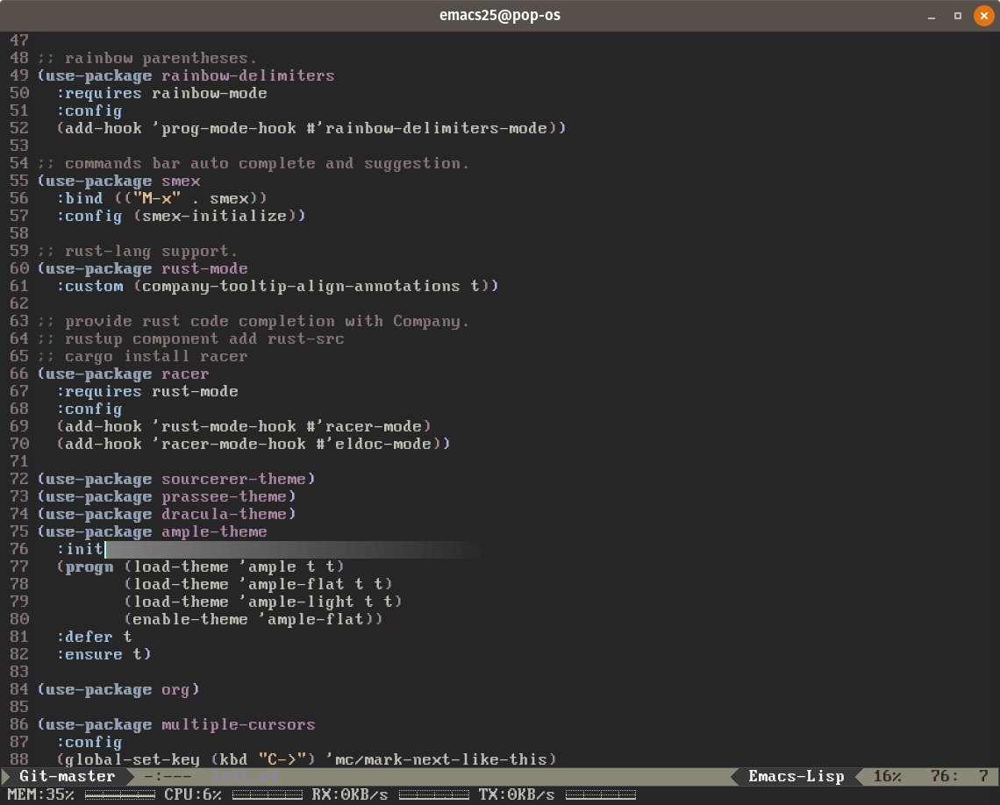
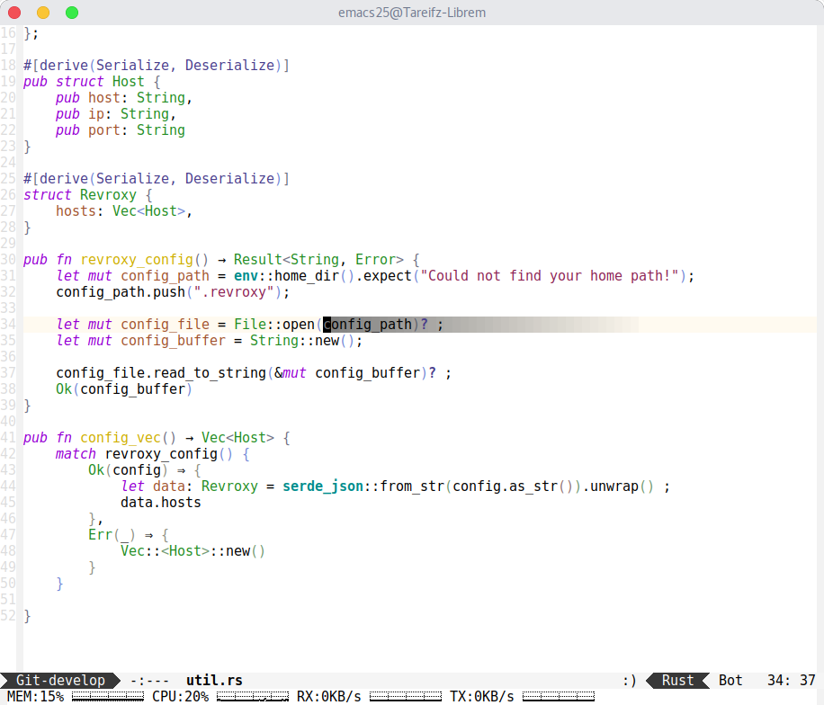
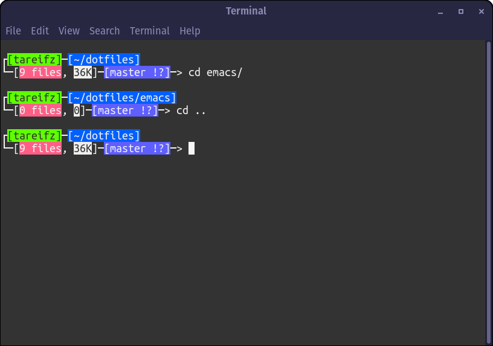

## Prerequisite

GNU Stow

`apt install stow`

---

## Usage

In your home directory

* `git clone http://dotfiles-repo.com/dotfiles`
* `cd dotfiles`

Then `stow your-app`

* `stow bash emacs ...`

---

## Preview

### Emacs

---

### Bash

---

### Theme

---
